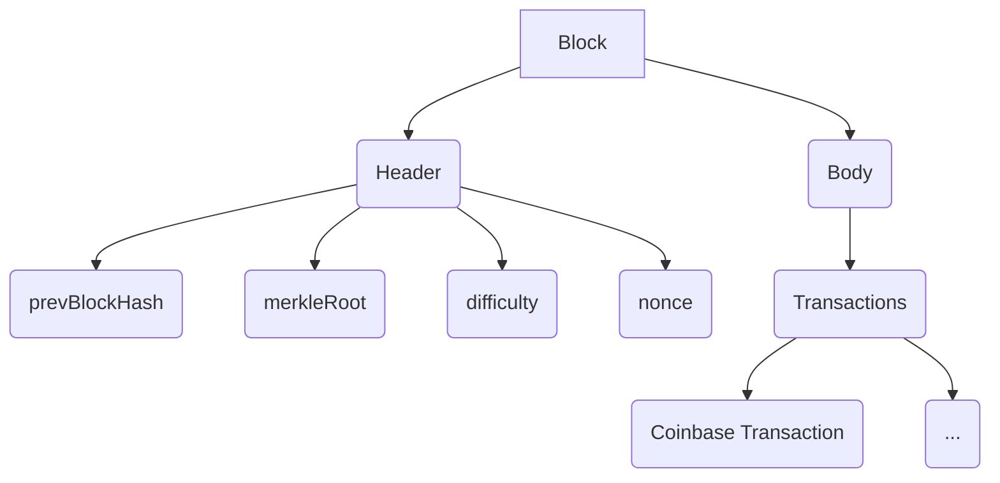
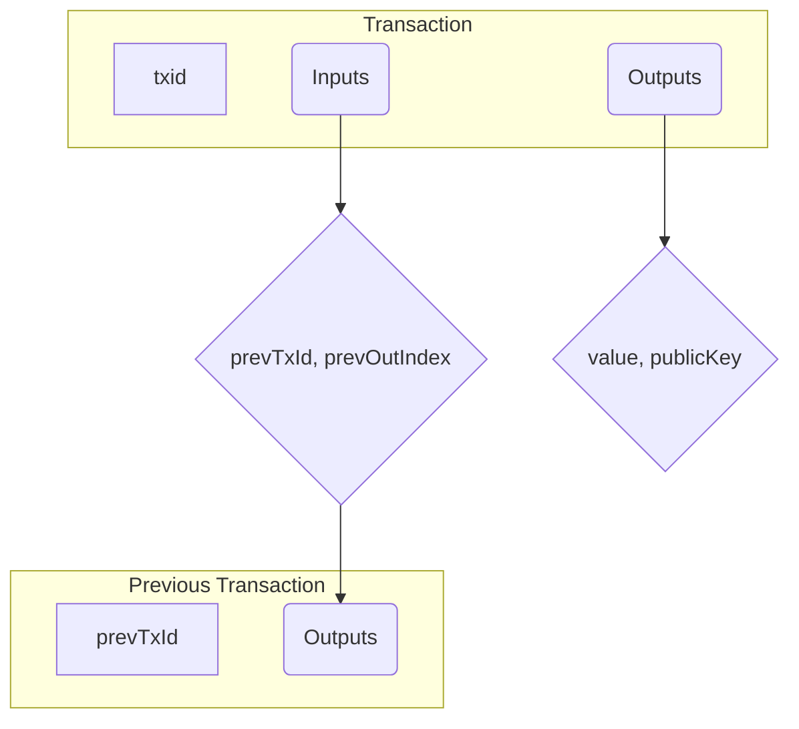
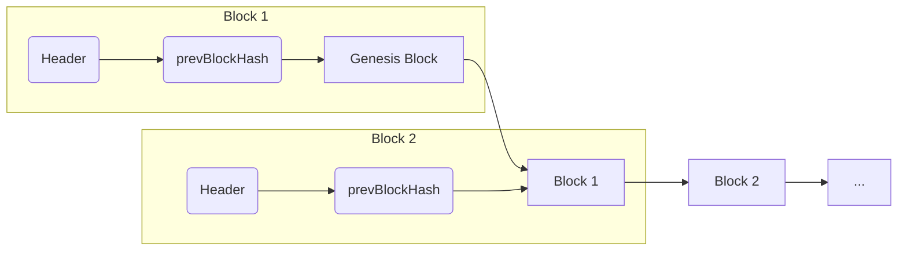

# Blockchain Primitives

This project uses the minimum fields needed for a functioning, educational blockchain.

## Block

A block is a data structure that bundles a set of transactions. It is the fundamental building block of the blockchain. Each block is linked to the previous block, forming a chain of blocks.

A block consists of two main parts: a header and a body.

### Block Header

The block header contains metadata about the block.

- **`prevBlockHash` (32 bytes):** A reference to the hash of the previous block in the chain. This is what links the blocks together, forming the blockchain. For the genesis block, this value is a string of 64 zeros.
- **`merkleRoot` (32 bytes):** The root of the Merkle tree of all the transactions in the block. This is a cryptographic hash that allows for efficient verification of the integrity of the transactions.
- **`difficulty` (1 byte):** A value that determines how hard it is to find a valid hash for the block. This is used in the mining process.
- **`nonce` (4 bytes):** A random value that miners change in order to find a valid hash for the block that meets the difficulty requirement.

The hash of the block header, `blockHash = Hash(header)`, serves as the unique identifier for the block. It is not stored in the header itself but is calculated by all nodes.

### Block Body

The block body contains the list of transactions included in the block.

- **Transactions:** A list of transactions. The first transaction in the list is a special transaction called the **coinbase transaction**. This transaction is created by the miner of the block and is used to collect the block reward and any transaction fees.

### Block Size

The "block size" refers to the total serialized size of the block in bytes, including the header and all transactions. In this project, we use a fixed block size limit of 2000 bytes.

## Transaction

A transaction is a data structure that represents a transfer of value between users of the blockchain. Transactions are the "payload" of the blocks.

A transaction consists of a list of inputs and a list of outputs.

- **`inputs[]`:** A list of inputs. Each input references a previous unspent transaction output (UTXO) using a `(prevTxId, prevOutIndex)` tuple. It also contains a `publicKey` and a `signature` to authorize the spending of the referenced UTXO.
- **`outputs[]`:** A list of outputs. Each output creates a new UTXO, which is a certain `value` of coins locked to a specific `publicKey`. These UTXOs can then be spent by the owner of the corresponding private key in a future transaction.
- **`txid`:** The transaction ID, which is the hash of the serialized transaction. It serves as a unique identifier for the transaction.

### Fees (implicit)

Transaction fees are an important part of the blockchain ecosystem. They are an incentive for miners to include a transaction in a block.

The transaction fee is not explicitly defined in the transaction data structure. Instead, it is calculated as the difference between the sum of the values of the inputs and the sum of the values of the outputs.

`fee = sum(input values) - sum(output values)`

The fee must be non-negative (`>= 0`).

The miner who includes the transaction in a block collects the transaction fee. This is done by adding the fee to the coinbase transaction in the block.

## Chain as a Linked List

The blockchain is essentially a distributed, immutable ledger implemented as a linked list of blocks. Each block is cryptographically linked to the previous block, all the way back to the first block, which is called the **genesis block**.

This linking is achieved through the `prevBlockHash` field in the block header. Each block header contains a hash of the previous block's header. This creates a chain of blocks, where each block confirms the integrity of the previous one.

A node in the blockchain network keeps a pointer to the current tip of the chain (the most recently added block). When a new block is mined, the node validates it and, if it is valid, adds it to the chain, updating its pointer to the new tip.

## Cryptographic Hashing

A cryptographic hash function is a mathematical algorithm that takes an input of any size and produces a fixed-size output, which is known as the **hash**. This process is one-way, meaning it is computationally infeasible to reverse the process and find the original input from the hash.

In the context of this project, we use a hash function (e.g., SHA-256) for several purposes:

- **Creating `blockHash`:** The hash of a block's header serves as its unique identifier.
- **Creating `txid`:** The hash of a transaction's data serves as its unique identifier.
- **Building the Merkle Tree:** The Merkle tree is constructed by repeatedly hashing pairs of transaction IDs.

Key properties of a cryptographic hash function include:

- **Deterministic:** The same input will always produce the same output.
- **Pre-image resistance:** It is computationally infeasible to find the input that produced a given hash.
- **Second pre-image resistance:** Given an input and its hash, it is computationally infeasible to find a different input that produces the same hash.
- **Collision resistance:** It is computationally infeasible to find two different inputs that produce the same hash.

## Public-Key Cryptography

Public-key cryptography, also known as asymmetric cryptography, is a cryptographic system that uses pairs of keys: a **public key** and a **private key**.

- **Public Key:** This key can be shared with anyone. It is used to verify digital signatures and to encrypt messages. In our blockchain, the public key is used as the "address" to which coins are sent.
- **Private Key:** This key must be kept secret by its owner. It is used to create digital signatures and to decrypt messages.

### Digital Signatures

A digital signature is a mathematical scheme for verifying the authenticity of digital messages or documents. It provides a high level of security and can be used to ensure that a message was created by a known sender (authentication) and that it was not altered in transit (integrity).

In our blockchain, digital signatures are used to authorize the spending of UTXOs. When a user wants to spend a UTXO, they must create a digital signature using their private key. This signature proves that they are the owner of the corresponding public key and that they have authorized the transaction.

---
[← Back: Background](background.md) · [Next: Transactions →](transactions.md)