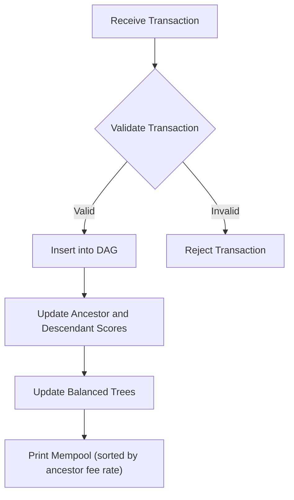
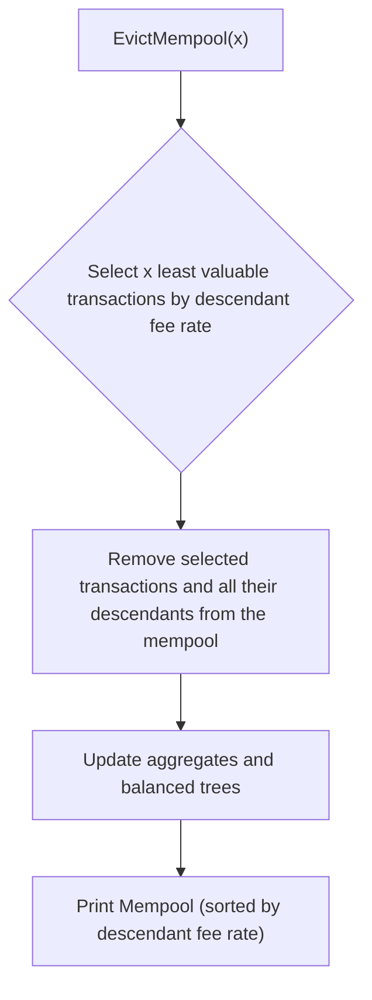
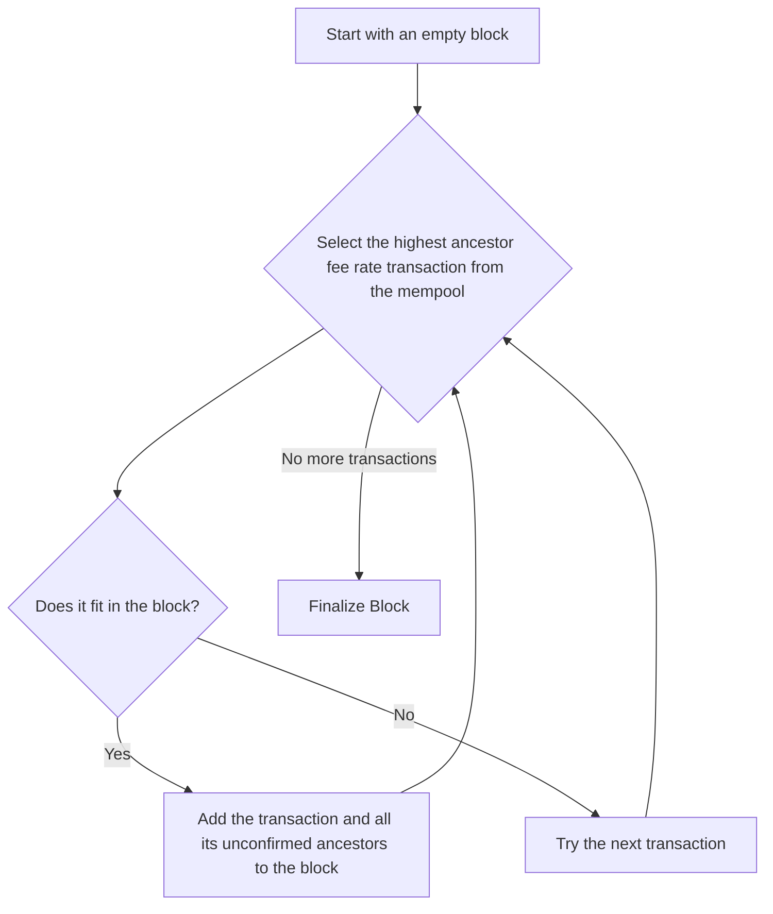

# The Mempool

The mempool (short for memory pool) is the waiting area for unconfirmed transactions in a blockchain node. When a node receives a new transaction, it validates it and, if it is valid, adds it to the mempool. The mempool is a dynamic data structure that is constantly changing as new transactions are added and existing ones are included in blocks.

## The Mempool as a DAG

The transactions in the mempool form a Directed Acyclic Graph (DAG). This is because transactions can have dependencies on each other. If a transaction (the "child") spends an output created by another transaction in the mempool (the "parent"), there is a dependency from the parent to the child.

A child transaction cannot be included in a block before its parent. This is because the child transaction is not valid until the parent transaction has been confirmed.

## Transaction Prioritization

Since blocks have a limited size, miners need a way to prioritize which transactions to include. In this project, we use two different scoring mechanisms to rank transactions in the mempool:

- **Ancestor Fee Rate (for selection):** This score is used to select the most profitable transactions to include in a new block. It is calculated as the total fees of a transaction and all of its ancestors, divided by the total size of the transaction and all of its ancestors.

  `score = (fee(tx) + fees(ancestors)) / (size(tx) + size(ancestors))`

- **Descendant Fee Rate (for eviction):** This score is used to decide which transactions to evict from the mempool if it becomes full. It is calculated as the total fees of a transaction and all of its descendants, divided by the total size of the transaction and all of its descendants.

  `score = (fee(tx) + fees(descendants)) / (size(tx) + size(descendants))`

These scores are maintained using two balanced binary search trees, which allow for efficient ordering and selection of transactions.

## Adding Transactions to the Mempool

When a new transaction is added to the mempool, the following steps are taken:

## Evicting Transactions from the Mempool

If the mempool grows too large, it may be necessary to evict some transactions. The goal is to remove the least valuable transactions to make room for more profitable ones.

In this project, we use the descendant fee rate to determine which transactions to evict. A low descendant fee rate indicates that a transaction and its children are not contributing much in terms of fees, making them good candidates for eviction.

When `EvictMempool(x)` is called, the following steps are taken:

## Block Assembly

Block assembly is the process by which a miner selects a set of transactions from the mempool to include in a new block. The goal is to create a block that is both valid and as profitable as possible.

In this project, we use a greedy algorithm based on the ancestor fee rate to select transactions.

Here is a step-by-step guide to the block assembly process:

1.  **Start with an empty block:** Create a new block template.
2.  **Select the most profitable transaction:** From the mempool, select the transaction with the highest ancestor fee rate.
3.  **Check if it fits:** Check if the selected transaction and all of its unconfirmed ancestors can fit into the remaining space in the block.
4.  **Add to block:** If it fits, add the transaction and all of its unconfirmed ancestors to the block. Update the remaining block size.
5.  **Repeat:** Go back to step 2 and repeat the process until no more transactions can be added to the block.
6.  **Finalize the block:** Once the block is full, or there are no more transactions to add, finalize the block by creating the coinbase transaction, building the Merkle tree, and filling in the block header.

---
[← Back: The UTXO Model](utxo.md) · [Next: Mining →](mining.md)