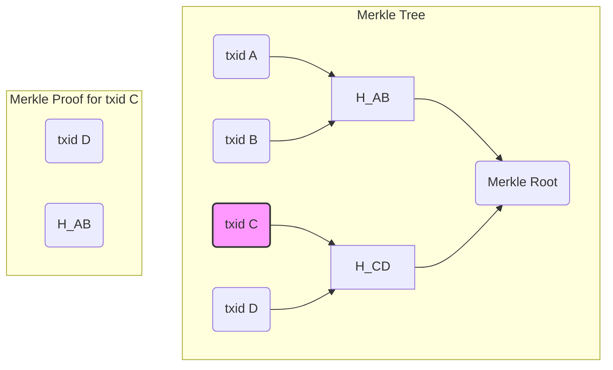

# Merkle Trees and Proofs

A Merkle tree, also known as a binary hash tree, is a data structure used in computer science and cryptography to efficiently verify the integrity of large data sets. In the context of a blockchain, a Merkle tree is used to summarize all the transactions in a block, producing a single 32-byte hash called the **Merkle root**.

## Why it matters here

The Merkle root is included in the block header, and it provides several key benefits:

- **Efficient Verification:** It allows for a lightweight and efficient way to verify if a transaction is included in a block without needing to download the entire block. This is particularly important for light clients that have limited resources.
- **Tamper Resistance:** Any change to a single transaction will alter its hash, which will then alter the hashes of all the parent nodes in the Merkle tree, ultimately changing the Merkle root. This makes it easy to detect any tampering with the transaction data.

## Building a Merkle Tree

A Merkle tree is built from the bottom up, starting with the leaves of the tree, which are the hashes of the individual transactions in the block.

Here are the steps to build a Merkle tree:

1.  **Hash the Transactions:** First, we compute the hash of each transaction in the block. These hashes are the leaves of the Merkle tree.
2.  **Pair and Hash:** We then group the leaf hashes into pairs and compute the hash of the concatenation of each pair. These new hashes form the next level of the tree.
3.  **Handle Odd Number of Hashes:** If there is an odd number of hashes at any level, the last hash is duplicated to create a pair.
4.  **Repeat Until Root:** We repeat the process of pairing and hashing until we are left with a single hash, which is the Merkle root.

### Example

Here is an example of a Merkle tree with four transactions (A, B, C, and D):

```mermaid
graph TD
    subgraph "Level 2 (Root)"
        H_ABCD(Merkle Root = H(H_AB + H_CD))
    end

    subgraph "Level 1"
        H_AB(H(txid A + txid B)) --> H_ABCD
        H_CD(H(txid C + txid D)) --> H_ABCD
    end

    subgraph "Level 0 (Leaves)"
        A(txid A) --> H_AB
        B(txid B) --> H_AB
        C(txid C) --> H_CD
        D(txid D) --> H_CD
    end
```

## Merkle Proofs

A Merkle proof is a small piece of data that allows a verifier to confirm that a specific transaction is included in a block without needing to have the entire block. The proof consists of the transaction hash and a list of the sibling hashes along the path from the transaction to the Merkle root.

### How it Works

To verify a Merkle proof, a verifier needs three pieces of information:

1.  The hash of the transaction to be verified.
2.  The Merkle proof, which is the list of sibling hashes.
3.  The Merkle root from the block header.

The verifier then uses this information to reconstruct the Merkle root and checks if it matches the Merkle root in the block header.

### Verification Steps

Here are the steps to verify a Merkle proof for a transaction:

1.  **Start with the transaction hash:** Take the hash of the transaction you want to verify.
2.  **Combine with sibling hashes:** For each hash in the Merkle proof, concatenate it with the current hash and compute the hash of the result. The order of concatenation depends on whether the sibling is a left or right node in the tree.
3.  **Repeat until you reach the root:** Continue this process until you have a single hash.
4.  **Compare with the Merkle root:** Compare the resulting hash with the Merkle root from the block header. If they match, the transaction is proven to be included in the block.

### Example

Let's say we want to prove that transaction C is in the block from our previous example. The Merkle proof would consist of the hash of transaction D and the hash `H_AB`.



To verify the proof, the verifier would perform the following steps:

1.  Hash transaction C to get `txid C`.
2.  Concatenate `txid C` with the first element of the proof (`txid D`) and hash the result to get `H_CD`.
3.  Concatenate the second element of the proof (`H_AB`) with `H_CD` and hash the result to get `H_ABCD`.
4.  Compare `H_ABCD` with the Merkle root from the block header. If they match, the proof is valid.

---
[← Back: Mining](mining.md) · [Next: Digital Signatures and the Transaction Preimage →](signatures-preimage.md)