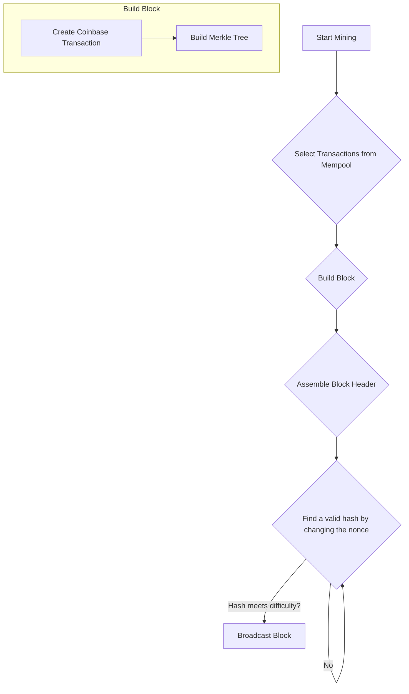

# Mining

Mining is the process by which new blocks are created and added to a blockchain. In a Proof-of-Work (PoW) blockchain like the one you are building, mining serves two primary purposes:

1.  **To create new coins:** Miners are rewarded with newly created coins (the block subsidy) for their efforts.
2.  **To secure the network:** The mining process is computationally intensive, which makes it difficult and expensive for an attacker to modify the blockchain.

Miners are the participants in the network who perform the mining process. They compete with each other to be the first to find a valid block and add it to the chain.

## The Mining Process

The mining process can be broken down into the following steps:

1.  **Select Transactions:** The miner selects a set of transactions from the mempool to include in the new block. This is typically done using a greedy algorithm that prioritizes transactions with the highest fees.
2.  **Build the Block:** The miner assembles the block, which includes creating the coinbase transaction, building the Merkle tree, and assembling the block header.
3.  **Solve the PoW Puzzle:** The miner then repeatedly hashes the block header, changing a random value called the `nonce` each time, until a hash is found that meets the current mining difficulty.
4.  **Broadcast the Block:** Once a valid hash is found, the miner broadcasts the new block to the rest of the network.

### Why Topological Order?

When selecting transactions from the mempool, it is important to ensure that they are included in the block in topological order. This means that if a transaction (child) spends an output from another transaction (parent), the parent must appear in the block before the child. This ensures that when the block is validated, the inputs for every transaction are valid.

## Proof-of-Work (PoW)

Proof-of-Work is the consensus algorithm that is used to secure the blockchain. It is a mechanism that requires a significant amount of computational effort to create a new block, but it is easy for other nodes to verify that the work has been done.

In our blockchain, the PoW puzzle involves finding a `nonce` (a random number) such that when the block header is hashed, the resulting hash has a certain number of leading zero bits. The number of required leading zero bits is determined by the **mining difficulty**.

By making it computationally expensive to create a new block, PoW ensures that it is prohibitively difficult for an attacker to modify the blockchain. To change a block, an attacker would have to re-mine that block and all subsequent blocks, which would require a massive amount of computational power.

## Mining Difficulty

Mining difficulty is a measure of how difficult it is to find a valid hash for a new block. In our project, the difficulty is represented as the number of leading zero bits required in the block hash.

`difficulty = leadingZeroBits`

A higher difficulty means that miners have to perform more work to find a valid hash, which increases the security of the network. A lower difficulty means that blocks can be mined more quickly.

In a real-world blockchain like Bitcoin, the mining difficulty is adjusted automatically every 2016 blocks to ensure that the average time between blocks remains constant (around 10 minutes). In our project, the difficulty is set manually.

## The Block Reward

Miners are incentivized to participate in the mining process through the **block reward**. The block reward is composed of two parts:

1.  **Block Subsidy:** A fixed amount of new coins that are created out of thin air. This is the primary way that new currency is introduced into the system.
2.  **Transaction Fees:** The sum of all the fees from the transactions included in the block.

The total block reward is given to the miner in the coinbase transaction of the block.

`block reward = block subsidy + transaction fees`
