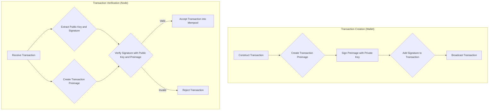

# Digital Signatures and the Transaction Preimage

Digital signatures are a fundamental component of any cryptocurrency, providing the mechanism for authentication and authorization. In a blockchain, digital signatures are used to prove ownership of the funds being spent and to authorize a transaction.

## The Purpose of Digital Signatures

A digital signature in a transaction serves two main purposes:

1.  **Authentication:** It proves that the person who created the transaction is the legitimate owner of the funds being spent.
2.  **Integrity:** It ensures that the transaction has not been altered or tampered with after it was signed.

## The Transaction Preimage

To create a digital signature, we do not sign the entire transaction data. Instead, we sign a specific subset of the data called the **transaction preimage**. This is to avoid a circular dependency where the signature would have to be part of the data being signed.

The transaction preimage is a "clean" version of the transaction that includes:

- **Inputs:** Only the references to the UTXOs being spent (`prevTxId` and `prevOutIndex`).
- **Outputs:** The `value` and `publicKey` for each new UTXO being created.

The signature fields in the inputs are left empty in the preimage.

```
preimage = serialize({
  inputs:  [{ prevTxId, prevOutIndex }],
  outputs: [{ value, publicKey }]
})
```

## How Signatures are Created and Verified

The process of creating and verifying a digital signature involves the use of a key pair: a private key and a public key.

- **Private Key:** Kept secret by the owner and used to create signatures.
- **Public Key:** Shared with others and used to verify signatures.

Here is a step-by-step overview of the signing and verification process:



### Signing a Transaction

1.  The user's wallet software constructs the transaction.
2.  It then creates the transaction preimage.
3.  The wallet signs the preimage using the user's private key.
4.  The resulting signature is added to the appropriate input field in the transaction.

### Verifying a Transaction

1.  A node receives the transaction.
2.  For each input, the node finds the referenced UTXO to get the owner's public key.
3.  The node independently creates the transaction preimage from the transaction data.
4.  It then uses the public key from the UTXO and the signature from the input to verify that the signature is valid for the created preimage.
5.  If all signatures in the transaction are valid, and all other validation rules pass, the transaction is considered valid.

## The Importance of the Preimage

The use of a transaction preimage is crucial for ensuring the integrity of the transaction. If an attacker tries to alter any part of the transaction that is included in the preimage (such as the amount of an output or the recipient's public key), the preimage will change. This will cause the digital signature to become invalid, and the transaction will be rejected by the network.

---
[← Back: Merkle Trees and Proofs](merkle.md) · [Next: Serialization and Hashing →](serialization-hashing.md)