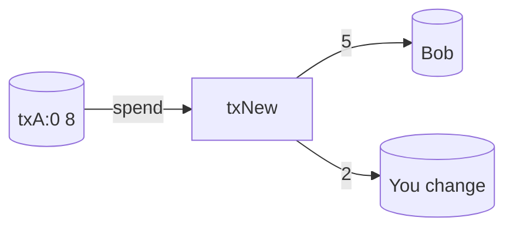

# Example: End-to-End Spend with Fees

Assume you own a UTXO of 8 units at `(txA, 0)` payable to your `publicKey`.

## 1) Build transaction
- Inputs: `{ prevTxId: txA, prevOutIndex: 0, publicKey: you, signature: SIG }`
- Outputs:
  - 5 → Bob (`publicKeyBob`)
  - 2 → change back to you (`publicKeyYou`)

### Preimage
```
serialize({
  inputs:  [{ prevTxId: txA, prevOutIndex: 0 }],
  outputs: [{ value: 5, publicKey: Bob }, { value: 2, publicKey: You }]
})
```
Sign this preimage with your private key to produce `signature`.

## 2) Fee calculation
- Sum inputs = 8
- Sum outputs = 7
- Fee = 1 (miner collects later via coinbase)

## 3) Mempool and selection
- Transaction enters mempool; it gets a score based on fee/size
- Miner may include it if it fits in the 10-tx capacity and improves fees



## 4) After block is mined
- UTXO updates:
  - Remove `(txA, 0)`
  - Add `(txNew, 0)` → 5 to Bob
  - Add `(txNew, 1)` → 2 to You
- Coinbase output increases by your 1-unit fee (plus subsidy and other fees)

