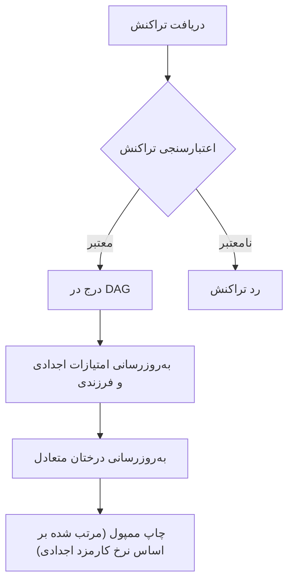
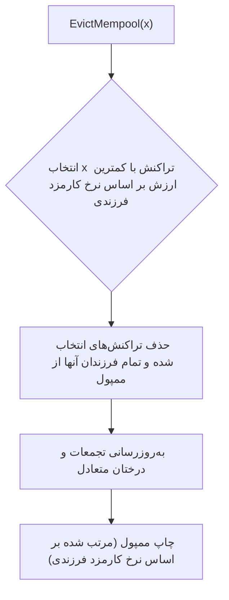
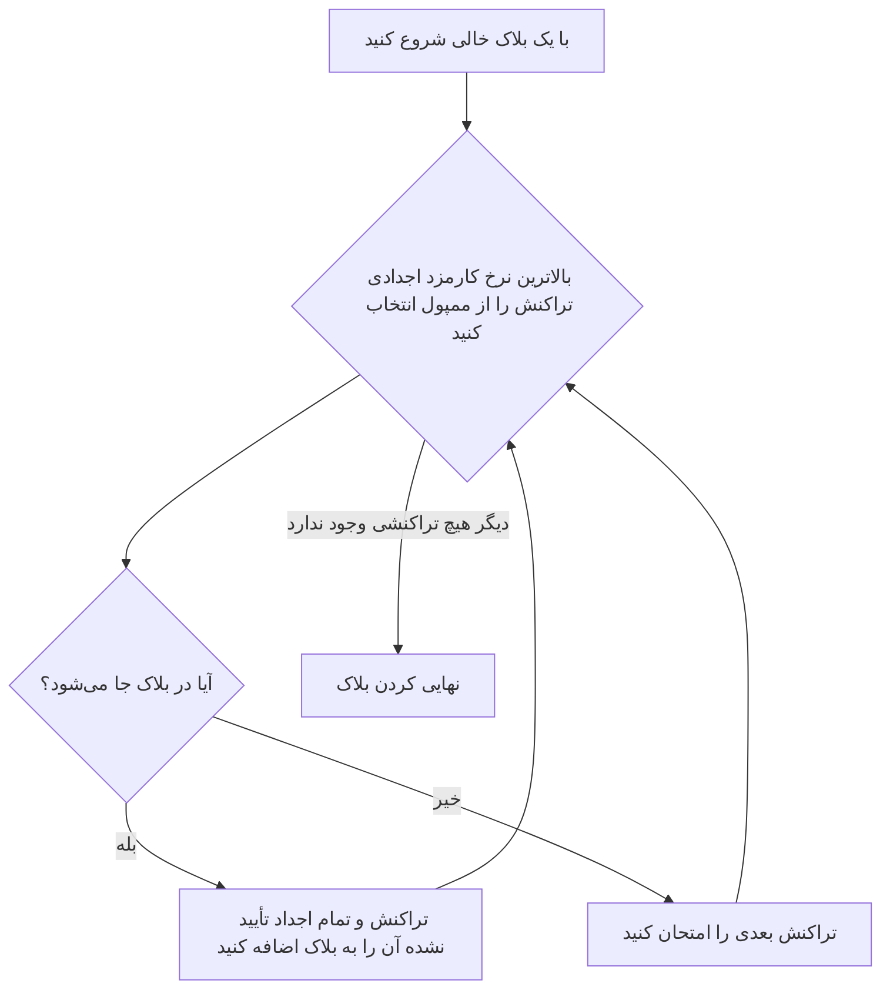

# ممپول (Mempool)

مِم‌پول (Mempool) (مخفف Memory Pool) منطقه انتظاری برای تراکنش‌های تأیید نشده در یک نود بلاکچین است. هنگامی که یک نود تراکنش جدیدی را دریافت می‌کند، آن را اعتبارسنجی کرده و در صورت معتبر بودن، به ممپول اضافه می‌کند. ممپول یک ساختار داده پویا است که به طور مداوم با اضافه شدن تراکنش‌های جدید و گنجانده شدن تراکنش‌های موجود در بلاک‌ها، تغییر می‌کند.

## ممپول به عنوان یک DAG

تراکنش‌ها در ممپول یک گراف جهت‌دار غیرمدور (DAG - Directed Acyclic Graph) را تشکیل می‌دهند. این به دلیل این است که تراکنش‌ها می‌توانند وابستگی‌هایی به یکدیگر داشته باشند. اگر یک تراکنش ("فرزند") خروجی ایجاد شده توسط تراکنش دیگری در ممپول ("والد") را خرج کند، یک وابستگی از والد به فرزند وجود دارد.

یک تراکنش فرزند نمی‌تواند قبل از والد خود در یک بلاک گنجانده شود. این به این دلیل است که تراکنش فرزند تا زمانی که تراکنش والد تأیید نشده باشد، معتبر نیست.

## اولویت‌بندی تراکنش

از آنجایی که بلاک‌ها دارای اندازه محدودی هستند، ماینرها به روشی برای اولویت‌بندی تراکنش‌ها برای گنجاندن نیاز دارند. در این پروژه، ما از دو مکانیزم امتیازدهی مختلف برای رتبه‌بندی تراکنش‌ها در ممپول استفاده می‌کنیم:

-   **نرخ کارمزد اجدادی (برای انتخاب):** این امتیاز برای انتخاب سودآورترین تراکنش‌ها برای گنجاندن در یک بلاک جدید استفاده می‌شود. این امتیاز به عنوان مجموع کارمزدهای یک تراکنش و تمام اجداد آن، تقسیم بر مجموع اندازه تراکنش و تمام اجداد آن محاسبه می‌شود.

    `امتیاز = (کارمزد(tx) + کارمزد(اجداد)) / (اندازه(tx) + اندازه(اجداد))`

-   **نرخ کارمزد فرزندی (برای حذف):** این امتیاز برای تصمیم‌گیری در مورد حذف کدام تراکنش‌ها از ممپول در صورت پر شدن آن استفاده می‌شود. این امتیاز به عنوان مجموع کارمزدهای یک تراکنش و تمام فرزندان آن، تقسیم بر مجموع اندازه تراکنش و تمام فرزندان آن محاسبه می‌شود.

    `امتیاز = (کارمزد(tx) + کارمزد(فرزندان)) / (اندازه(tx) + اندازه(فرزندان))`

این امتیازات با استفاده از دو درخت جستجوی دودویی متعادل نگهداری می‌شوند که امکان مرتب‌سازی و انتخاب کارآمد تراکنش‌ها را فراهم می‌کنند.

## افزودن تراکنش‌ها به ممپول

هنگامی که یک تراکنش جدید به ممپول اضافه می‌شود، مراحل زیر انجام می‌شود:

## حذف تراکنش‌ها از ممپول

اگر ممپول بیش از حد بزرگ شود، ممکن است لازم باشد برخی از تراکنش‌ها حذف شوند. هدف حذف کم‌ارزش‌ترین تراکنش‌ها برای ایجاد فضا برای تراکنش‌های سودآورتر است.

در این پروژه، ما از نرخ کارمزد فرزندی برای تعیین اینکه کدام تراکنش‌ها حذف شوند، استفاده می‌کنیم. نرخ کارمزد فرزندی پایین نشان می‌دهد که یک تراکنش و فرزندان آن سهم چندانی از نظر کارمزد ندارند، که آنها را نامزدهای خوبی برای حذف می‌کند.

هنگامی که `EvictMempool(x)` فراخوانی می‌شود، مراحل زیر انجام می‌شود:

## مونتاژ بلاک

مونتاژ بلاک فرآیندی است که طی آن یک ماینر مجموعه‌ای از تراکنش‌ها را از ممپول برای گنجاندن در یک بلاک جدید انتخاب می‌کند. هدف ایجاد یک بلاک است که هم معتبر و هم تا حد امکان سودآور باشد.

در این پروژه، ما از یک الگوریتم حریصانه بر اساس نرخ کارمزد اجدادی برای انتخاب تراکنش‌ها استفاده می‌کنیم.

در اینجا یک راهنمای گام به گام برای فرآیند مونتاژ بلاک آورده شده است:

1.  **با یک بلاک خالی شروع کنید:** یک قالب بلاک جدید ایجاد کنید.
2.  **سودآورترین تراکنش را انتخاب کنید:** از ممپول، تراکنش با بالاترین نرخ کارمزد اجدادی را انتخاب کنید.
3.  **بررسی کنید که آیا جا می‌شود:** بررسی کنید که آیا تراکنش انتخاب شده و تمام اجداد تأیید نشده آن می‌توانند در فضای باقی‌مانده در بلاک جا شوند.
4.  **به بلاک اضافه کنید:** اگر جا شد، تراکنش و تمام اجداد تأیید نشده آن را به بلاک اضافه کنید. اندازه باقی‌مانده بلاک را به‌روزرسانی کنید.
5.  **تکرار کنید:** به مرحله ۲ بازگردید و فرآیند را تا زمانی که دیگر هیچ تراکنشی نمی‌تواند به بلاک اضافه شود، تکرار کنید.
6.  **نهایی کردن بلاک:** هنگامی که بلاک پر شد، یا دیگر هیچ تراکنشی برای اضافه کردن وجود ندارد، بلاک را با ایجاد تراکنش کوین‌بیس، ساخت درخت مرکل و پر کردن هدر بلاک نهایی کنید.

---
[← بازگشت: مدل UTXO](utxo.md) · [بعدی: استخراج →](mining.md)