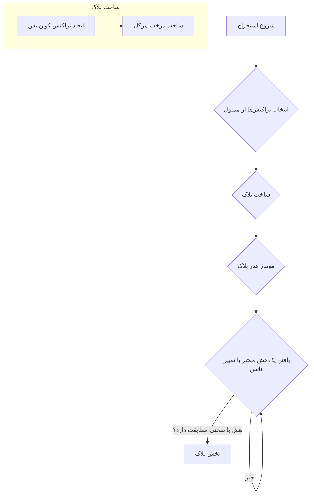

# استخراج (Mining)

استخراج (ماینینگ) فرآیندی است که طی آن بلاک‌های جدید ایجاد شده و به بلاکچین اضافه می‌شوند. در یک بلاکچین اثبات کار (PoW) مانند بلاکچینی که شما در حال ساخت آن هستید، استخراج دو هدف اصلی دارد:

1.  **ایجاد سکه‌های جدید:** به ماینرها به خاطر تلاش‌هایشان، سکه‌های تازه ایجاد شده (یارانه بلاک) پاداش داده می‌شود.
2.  **تأمین امنیت شبکه:** فرآیند استخراج از نظر محاسباتی فشرده است که تغییر بلاکچین را برای مهاجم دشوار و پرهزینه می‌کند.

ماینرها شرکت‌کنندگان در شبکه هستند که فرآیند استخراج را انجام می‌دهند. آنها با یکدیگر رقابت می‌کنند تا اولین نفری باشند که یک بلاک معتبر را پیدا کرده و به زنجیره اضافه می‌کنند.

## فرآیند استخراج

فرآیند استخراج را می‌توان به مراحل زیر تقسیم کرد:

1.  **انتخاب تراکنش‌ها:** ماینر مجموعه‌ای از تراکنش‌ها را از ممپول برای گنجاندن در بلاک جدید انتخاب می‌کند. این کار معمولاً با استفاده از یک الگوریتم حریصانه انجام می‌شود که تراکنش‌هایی با بالاترین کارمزد را اولویت‌بندی می‌کند.
2.  **ساخت بلاک:** ماینر بلاک را مونتاژ می‌کند که شامل ایجاد تراکنش کوین‌بیس، ساخت درخت مرکل و مونتاژ هدر بلاک است. هنگام استخراج بلاک جنسیس، `prevBlockHash` در هدر بلاک روی رشته‌ای از ۶۴ صفر تنظیم می‌شود.
3.  **حل پازل اثبات کار:** سپس ماینر به طور مکرر هدر بلاک را هش می‌کند و هر بار یک مقدار تصادفی به نام `nonce` را تغییر می‌دهد، تا زمانی که هشی پیدا شود که با سختی استخراج فعلی مطابقت داشته باشد.
4.  **پخش بلاک:** هنگامی که یک هش معتبر پیدا شد، ماینر بلاک جدید را به بقیه شبکه پخش می‌کند.

### چرا ترتیب توپولوژیکی؟

هنگام انتخاب تراکنش‌ها از ممپول، مهم است که اطمینان حاصل شود که آنها به ترتیب توپولوژیکی در بلاک گنجانده شده‌اند. این بدان معناست که اگر یک تراکنش (فرزند) خروجی تراکنش دیگری (والد) را خرج کند، والد باید قبل از فرزند در بلاک ظاهر شود. این تضمین می‌کند که هنگام اعتبارسنجی بلاک، ورودی‌های هر تراکنش معتبر هستند.

## اثبات کار (PoW)

اثبات کار الگوریتم اجماعی است که برای تأمین امنیت بلاکچین استفاده می‌شود. این مکانیزمی است که به مقدار قابل توجهی تلاش محاسباتی برای ایجاد یک بلاک جدید نیاز دارد، اما تأیید اینکه کار انجام شده است برای سایر گره‌ها آسان است.

در بلاکچین ما، پازل اثبات کار شامل یافتن یک `nonce` (عدد تصادفی) است به طوری که وقتی هدر بلاک هش می‌شود، هش حاصل دارای تعداد معینی بیت صفر پیشرو باشد. تعداد بیت‌های صفر پیشرو مورد نیاز توسط **سختی استخراج** تعیین می‌شود.

با پرهزینه کردن ایجاد یک بلاک جدید از نظر محاسباتی، اثبات کار تضمین می‌کند که تغییر بلاکچین برای مهاجم به شدت دشوار است. برای تغییر یک بلاک، مهاجم باید آن بلاک و تمام بلاک‌های بعدی را دوباره استخراج کند که به مقدار عظیمی از قدرت محاسباتی نیاز دارد.

## سختی استخراج

سختی استخراج معیاری است برای اندازه‌گیری میزان دشواری یافتن یک هش معتبر برای یک بلاک جدید. در پروژه ما، سختی به عنوان تعداد بیت‌های صفر پیشرو مورد نیاز در هش بلاک نمایش داده می‌شود.

`difficulty = leadingZeroBits`

سختی بالاتر به معنای آن است که ماینرها برای یافتن یک هش معتبر باید کار بیشتری انجام دهند که امنیت شبکه را افزایش می‌دهد. سختی پایین‌تر به معنای آن است که بلاک‌ها سریع‌تر استخراج می‌شوند.

در یک بلاکچین واقعی مانند بیتکوین، سختی استخراج به طور خودکار هر ۲۰۱۶ بلاک تنظیم می‌شود تا اطمینان حاصل شود که میانگین زمان بین بلاک‌ها ثابت (حدود ۱۰ دقیقه) باقی می‌ماند. در پروژه ما، سختی به صورت دستی تنظیم می‌شود.

## پاداش بلاک

ماینرها با **پاداش بلاک** برای شرکت در فرآیند استخراج انگیزه می‌گیرند. پاداش بلاک از دو بخش تشکیل شده است:

1.  **یارانه بلاک:** مقدار ثابتی از سکه‌های جدید که از هیچ ایجاد می‌شوند. این راه اصلی ورود پول جدید به سیستم است.
2.  **کارمزدهای تراکنش:** مجموع تمام کارمزدهای تراکنش‌های موجود در بلاک.

کل پاداش بلاک به ماینر در تراکنش کوین‌بیس بلاک داده می‌شود.

`پاداش بلاک = یارانه بلاک + کارمزدهای تراکنش`

---
[← بازگشت: ممپول](mempool.md) · [بعدی: درختان مرکل و اثبات‌ها →](merkle.md)