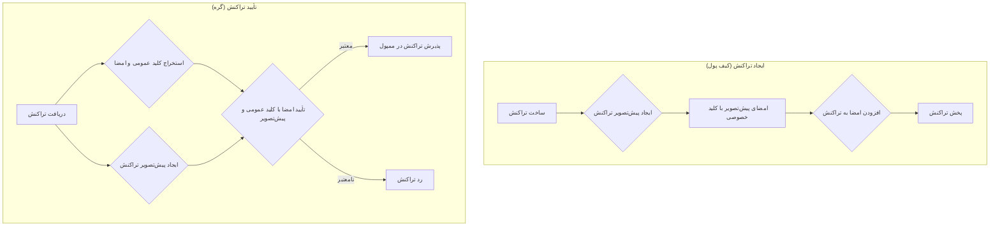

# امضاهای دیجیتال و پیش‌تصویر تراکنش

امضاهای دیجیتال جزء اساسی هر ارز دیجیتال هستند که مکانیزم احراز هویت و مجوز را فراهم می‌کنند. در بلاکچین، از امضاهای دیجیتال برای اثبات مالکیت وجوه در حال خرج شدن و مجوز دادن به تراکنش استفاده می‌شود.

## هدف امضاهای دیجیتال

یک امضای دیجیتال در یک تراکنش دو هدف اصلی دارد:

1.  **احراز هویت:** اثبات می‌کند که شخصی که تراکنش را ایجاد کرده است، مالک قانونی وجوه در حال خرج شدن است.
2.  **یکپارچگی:** تضمین می‌کند که تراکنش پس از امضا شدن، تغییر یا دستکاری نشده است.

## پیش‌تصویر تراکنش

برای ایجاد یک امضای دیجیتال، ما تمام داده‌های تراکنش را امضا نمی‌کنیم. در عوض، ما زیرمجموعه خاصی از داده‌ها به نام **پیش‌تصویر تراکنش** را امضا می‌کنیم. این برای جلوگیری از یک وابستگی دایره‌ای است که در آن امضا باید بخشی از داده‌های در حال امضا باشد.

پیش‌تصویر تراکنش یک نسخه "تمیز" از تراکنش است که شامل موارد زیر است:

-   **ورودی‌ها:** فقط مراجع به UTXOهای در حال خرج شدن (`prevTxId` و `prevOutIndex`).
-   **خروجی‌ها:** `value` و `publicKey` برای هر UTXO جدید در حال ایجاد.

فیلدهای امضا در ورودی‌ها در پیش‌تصویر خالی گذاشته می‌شوند.

```
preimage = serialize({
  inputs:  [{ prevTxId, prevOutIndex }],
  outputs: [{ value, publicKey }]
})
```

## نحوه ایجاد و تأیید امضاها

فرآیند ایجاد و تأیید یک امضای دیجیتال شامل استفاده از یک جفت کلید است: یک کلید خصوصی و یک کلید عمومی.

-   **کلید خصوصی:** توسط صاحب آن محرمانه نگه داشته می‌شود و برای ایجاد امضاها استفاده می‌شود.
-   **کلید عمومی:** با دیگران به اشتراک گذاشته می‌شود و برای تأیید امضاها استفاده می‌شود.

در اینجا یک نمای کلی گام به گام از فرآیند امضا و تأیید آورده شده است:



### امضای تراکنش

1.  نرم‌افزار کیف پول کاربر تراکنش را می‌سازد.
2.  سپس پیش‌تصویر تراکنش را ایجاد می‌کند.
3.  کیف پول پیش‌تصویر را با استفاده از کلید خصوصی کاربر امضا می‌کند.
4.  امضای حاصل به فیلد ورودی مناسب در تراکنش اضافه می‌شود.

### تأیید تراکنش

1.  یک گره تراکنش را دریافت می‌کند.
2.  برای هر ورودی، گره UTXO ارجاع شده را برای دریافت کلید عمومی مالک پیدا می‌کند.
3.  گره به طور مستقل پیش‌تصویر تراکنش را از داده‌های تراکنش ایجاد می‌کند.
4.  سپس از کلید عمومی از UTXO و امضا از ورودی برای تأیید اعتبار امضا برای پیش‌تصویر ایجاد شده استفاده می‌کند.
5.  اگر تمام امضاها در تراکنش معتبر باشند و تمام قوانین اعتبارسنجی دیگر نیز رعایت شوند، تراکنش معتبر تلقی می‌شود.

## اهمیت پیش‌تصویر

استفاده از پیش‌تصویر تراکنش برای تضمین یکپارچگی تراکنش حیاتی است. اگر مهاجم سعی کند هر بخشی از تراکنش را که در پیش‌تصویر گنجانده شده است (مانند مقدار یک خروجی یا کلید عمومی گیرنده) تغییر دهد، پیش‌تصویر تغییر خواهد کرد. این باعث می‌شود که امضای دیجیتال نامعتبر شود و تراکنش توسط شبکه رد خواهد شد.

---
[← بازگشت: درختان مرکل و اثبات‌ها](merkle.md) · [بعدی: سریالی‌سازی و هش کردن →](serialization-hashing.md)