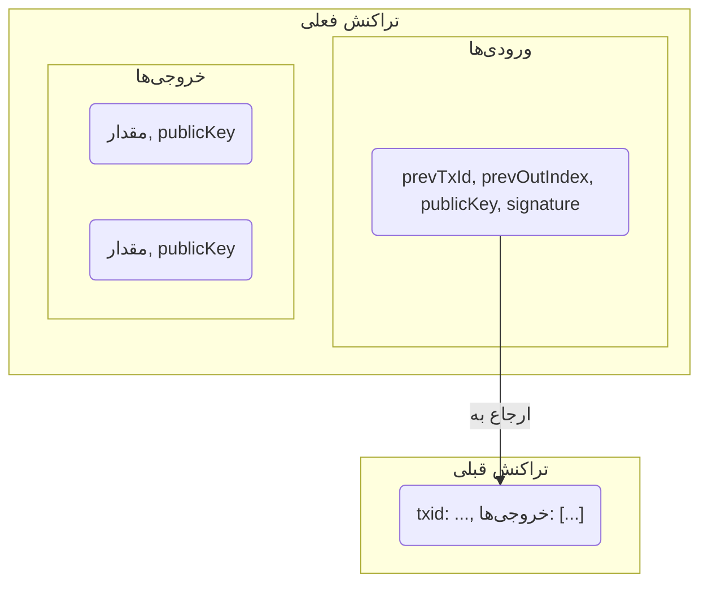

# تراکنش‌ها

تراکنش یک ساختار داده بنیادی در یک بلاکچین است که نشان‌دهنده انتقال ارزش بین شرکت‌کنندگان است. این یک پیام داده امضا شده است که به شبکه پخش می‌شود و در صورت معتبر بودن، در یک بلاک گنجانده می‌شود.

تراکنش‌ها در این پروژه از مدل UTXO (خروجی تراکنش خرج نشده) پیروی می‌کنند. این بدان معناست که یک تراکنش یک یا چند UTXO موجود را مصرف می‌کند و یک یا چند UTXO جدید ایجاد می‌کند.

## ساختار تراکنش

یک تراکنش از اجزای اصلی زیر تشکیل شده است:

-   **ورودی‌ها:** لیستی از ورودی‌ها که به UTXOهای موجود برای خرج شدن ارجاع می‌دهند.
-   **خروجی‌ها:** لیستی از UTXOهای جدید برای ایجاد.
-   **شناسه تراکنش (txid):** یک شناسه منحصر به فرد برای تراکنش.



### ورودی‌های تراکنش

یک ورودی تراکنش مشخص می‌کند که کدام UTXO در حال خرج شدن است. این شامل فیلدهای زیر است:

-   **`prevTxId`:** شناسه تراکنش تراکنشی که UTXO در حال خرج شدن را ایجاد کرده است.
-   **`prevOutIndex`:** شاخص خروجی در تراکنش قبلی که UTXO را ایجاد کرده است.
-   **`publicKey`:** کلید عمومی مالک UTXO. این برای تأیید امضا استفاده می‌شود.
-   **`signature`:** یک امضای دیجیتال ایجاد شده توسط مالک UTXO. این ثابت می‌کند که مالک مجوز خرج کردن UTXO را داده است.

### خروجی‌های تراکنش

یک خروجی تراکنش یک UTXO جدید ایجاد می‌کند که می‌تواند در یک تراکنش آتی خرج شود. این شامل فیلدهای زیر است:

-   **`value`:** مقدار ارز دیجیتال برای قفل شدن در UTXO جدید.
-   **`publicKey`:** کلید عمومی گیرنده. این "آدرس" است که مقدار به آن ارسال می‌شود.

### شناسه تراکنش (txid)

`txid` شناسه منحصر به فرد تراکنش است. این با هش کردن داده‌های تراکنش سریالی شده محاسبه می‌شود.

`txid = Hash(serialize(transaction))`

## امضاهای دیجیتال

یک امضای دیجیتال همان چیزی است که مجوز خرج کردن یک UTXO را می‌دهد. این امضا توسط مالک کلید خصوصی مربوط به کلید عمومی در UTXO ایجاد می‌شود.

امضا بر روی تمام داده‌های تراکنش ایجاد نمی‌شود، بلکه بر روی بخش خاصی از آن به نام **پیش‌تصویر تراکنش** ایجاد می‌شود. این برای جلوگیری از یک وابستگی دایره‌ای است که در آن امضا باید بخشی از داده‌های در حال امضا باشد.

پیش‌تصویر شامل داده‌های تراکنش سریالی شده است، اما فیلدهای امضا در ورودی‌ها خالی گذاشته می‌شوند.

```
preimage = serialize({
  inputs:  [{ prevTxId, prevOutIndex }],
  outputs: [{ value, publicKey }]
})
```

این بدان معناست که اگر هر بخشی از تراکنش (مانند مقدار خروجی یا گیرنده) تغییر کند، پیش‌تصویر تغییر خواهد کرد و امضا نامعتبر می‌شود. در این پروژه، تمام ورودی‌ها با یک پرچم `SIGHASH_ALL`-مانند امضا می‌شوند، به این معنی که امضا تمام ورودی‌ها و خروجی‌ها را پوشش می‌دهد.

## کارمزدهای تراکنش

کارمزدهای تراکنش انگیزه‌ای برای ماینرها برای گنجاندن یک تراکنش در یک بلاک است. کارمزد به صراحت در داده‌های تراکنش تعریف نشده است، بلکه به عنوان تفاوت بین مجموع مقادیر ورودی و مجموع مقادیر خروجی محاسبه می‌شود.

`کارمزد = مجموع (مقادیر ورودی) - مجموع (مقادیر خروجی)`

به عنوان مثال، اگر یک UTXO به ارزش ۸ سکه را خرج کنید و دو خروجی ایجاد کنید، یکی برای ۵ سکه به یک گیرنده و دیگری برای ۲ سکه به عنوان بازگشت به خودتان، کارمزد تراکنش خواهد بود:

`کارمزد = 8 - (5 + 2) = 1`

ماینری که این تراکنش را در یک بلاک قرار دهد، این کارمزد ۱ سکه‌ای را جمع‌آوری خواهد کرد.

## تراکنش کوین‌بیس

تراکنش کوین‌بیس یک نوع خاص از تراکنش است که توسط ماینر یک بلاک ایجاد می‌شود. این همیشه اولین تراکنش در یک بلاک است.

تراکنش کوین‌بیس دارای ویژگی‌های زیر است:

-   **ورودی واقعی ندارد:** این یک ورودی "ساختگی" (dummy) دارد که به یک UTXO واقعی ارجاع نمی‌دهد و نیازی به امضا ندارد.
-   **سکه‌های جدید ایجاد می‌کند:** خروجی تراکنش کوین‌بیس سکه‌های جدیدی را از هیچ ایجاد می‌کند. ارزش این خروجی مجموع یارانه بلاک (یک پاداش ثابت برای استخراج بلاک) و کل کارمزدهای تراکنش از تمام تراکنش‌های دیگر در بلاک است.

`ارزش خروجی کوین‌بیس = یارانه بلاک + کل کارمزدها`

---
[← بازگشت: اصول اولیه بلاکچین](blockchain-primitives.md) · [بعدی: مدل UTXO →](utxo.md)