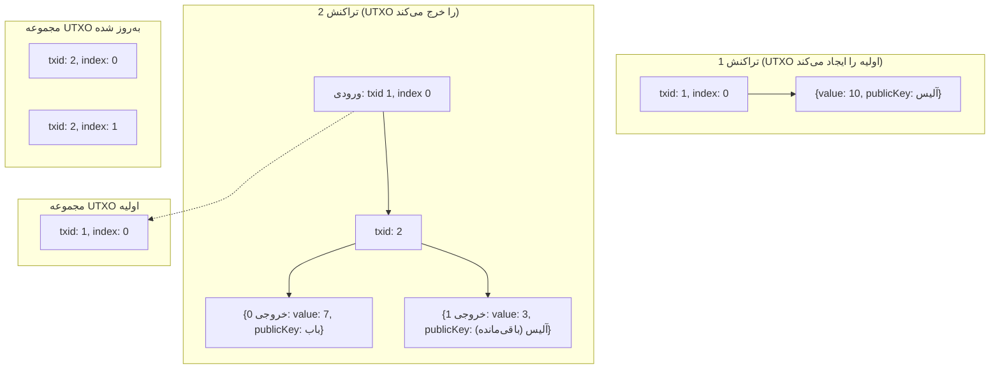

# مدل UTXO

مدل UTXO (Unspent Transaction Output - خروجی تراکنش خرج نشده) یک مفهوم بنیادی در بسیاری از ارزهای دیجیتال، از جمله بیتکوین و بلاکچینی است که شما در این پروژه می‌سازید. این مدل جایگزینی برای مدل مبتنی بر حساب است که توسط سایر بلاکچین‌ها مانند اتریوم استفاده می‌شود.

در مدل UTXO، هیچ حساب یا موجودی در سطح پروتکل وجود ندارد. در عوض، بلاکچین مجموعه‌ای از خروجی‌های تراکنش خرج نشده (UTXO) را پیگیری می‌کند. UTXO مقدار گسسته‌ای از ارز دیجیتال است که توسط فرستنده مجاز شده و می‌تواند توسط گیرنده خرج شود.

## مجموعه UTXO

مجموعه UTXO یک ساختار داده است که شامل تمام UTXOهایی است که در حال حاضر برای خرج شدن در دسترس هستند. این یک وضعیت جهانی است که هر بار که یک بلاک جدید به بلاکچین اضافه می‌شود، به‌روزرسانی می‌شود.

مجموعه UTXO را می‌توان به عنوان مجموعه‌ای از سکه‌های دیجیتال تصور کرد. هر UTXO دو ویژگی اصلی دارد:

-   **مقدار (Value):** مقدار ارز دیجیتالی که UTXO نشان می‌دهد.
-   **اسکریپت قفل (Locking Script) (`publicKey`):** اسکریپتی که شرایط لازم برای خرج کردن UTXO را مشخص می‌کند. در مورد ما، این صرفاً یک کلید عمومی است، به این معنی که UTXO می‌تواند با ارائه یک امضای دیجیتال معتبر از کلید خصوصی مربوطه خرج شود.

هر UTXO به طور منحصر به فردی توسط هش تراکنشی که آن را ایجاد کرده است (`txid`) و شاخص آن در لیست خروجی‌های آن تراکنش شناسایی می‌شود.

-   **کلید:** `txid:outputIndex`
-   **مقدار:** `{ value, publicKey }`

## نحوه به‌روزرسانی مجموعه UTXO

هنگامی که یک بلاک جدید به بلاکچین اضافه می‌شود، مجموعه UTXO به شرح زیر به‌روزرسانی می‌شود:

1.  **حذف UTXOهای خرج شده:** برای هر ورودی در هر تراکنش در بلاک (به جز تراکنش کوین‌بیس)، UTXO که به آن ارجاع می‌دهد از مجموعه UTXO حذف می‌شود.
2.  **افزودن UTXOهای جدید:** برای هر خروجی در هر تراکنش در بلاک، یک UTXO جدید ایجاد شده و به مجموعه UTXO اضافه می‌شود.

درون یک بلاک واحد، یک UTXO نمی‌تواند دو بار خرج شود. این یک قانون اجماع حیاتی است که از خرج مضاعف جلوگیری می‌کند.

### مثال

بیایید یک مثال ساده را در نظر بگیریم:

-   مجموعه UTXO فعلی شامل یک UTXO است: `{ txid: 1, index: 0, value: 10, publicKey: آلیس }`.
-   آلیس می‌خواهد ۷ سکه به باب ارسال کند.
-   آلیس تراکنشی با یک ورودی (که به UTXO متعلق به او ارجاع می‌دهد) و دو خروجی ایجاد می‌کند:
    -   خروجی ۰: `value: 7, publicKey: باب`
    -   خروجی ۱: `value: 3, publicKey: آلیس` (این باقی‌مانده است)

هنگامی که این تراکنش در یک بلاک گنجانده می‌شود، مجموعه UTXO به شرح زیر به‌روزرسانی می‌شود:

-   UTXO `{ txid: 1, index: 0 }` حذف می‌شود.
-   دو UTXO جدید اضافه می‌شوند:
    -   `{ txid: 2, index: 0, value: 7, publicKey: باب }`
    -   `{ txid: 2, index: 1, value: 3, publicKey: آلیس }`

---
[← بازگشت: تراکنش‌ها](transactions.md) · [بعدی: ممپول →](mempool.md)