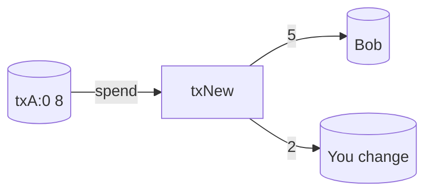

# مثال: هزینه سرتاسری با کارمزد

فرض کنید شما یک UTXO به میزان 8 واحد در `(txA, 0)` دارید که قابل پرداخت به `publicKey` شما است.

## 1) ساخت تراکنش
- ورودی‌ها: `{ prevTxId: txA, prevOutIndex: 0, publicKey: You, signature: SIG }`
- خروجی‌ها:
  - 5 ← Bob (`publicKeyBob`)
  - 2 ← برگشت تغییر به شما (`publicKeyYou`)

### تصویر اولیه (Preimage)
```
serialize({
  inputs:  [{ prevTxId: txA, prevOutIndex: 0 }],
  outputs: [{ value: 5, publicKey: Bob }, { value: 2, publicKey: You }]
})
```
این تصویر اولیه را با کلید خصوصی خود امضا کنید تا `signature` تولید شود.

## 2) محاسبه کارمزد
- مجموع ورودی‌ها = 8
- مجموع خروجی‌ها = 7
- کارمزد = 1 (ماینر بعداً از طریق کوین‌بیس جمع‌آوری می‌کند)

## 3) ممپول و انتخاب
- تراکنش وارد ممپول می‌شود؛ بر اساس کارمزد/اندازه امتیازی دریافت می‌کند.
- ماینر ممکن است آن را در صورت جا شدن در ظرفیت 10 تراکنش و بهبود کارمزدها، شامل کند.



## 4) پس از استخراج بلاک
- به‌روزرسانی‌های UTXO:
  - حذف `(txA, 0)`
  - اضافه کردن `(txNew, 0)` ← 5 به Bob
  - اضافه کردن `(txNew, 1)` ← 2 به You
- خروجی کوین‌بیس به میزان کارمزد 1 واحدی شما (به علاوه یارانه و سایر کارمزدها) افزایش می‌یابد.