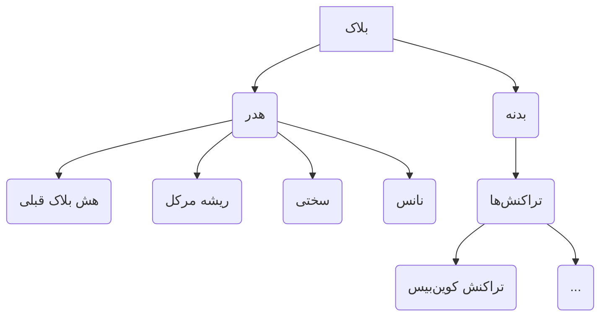
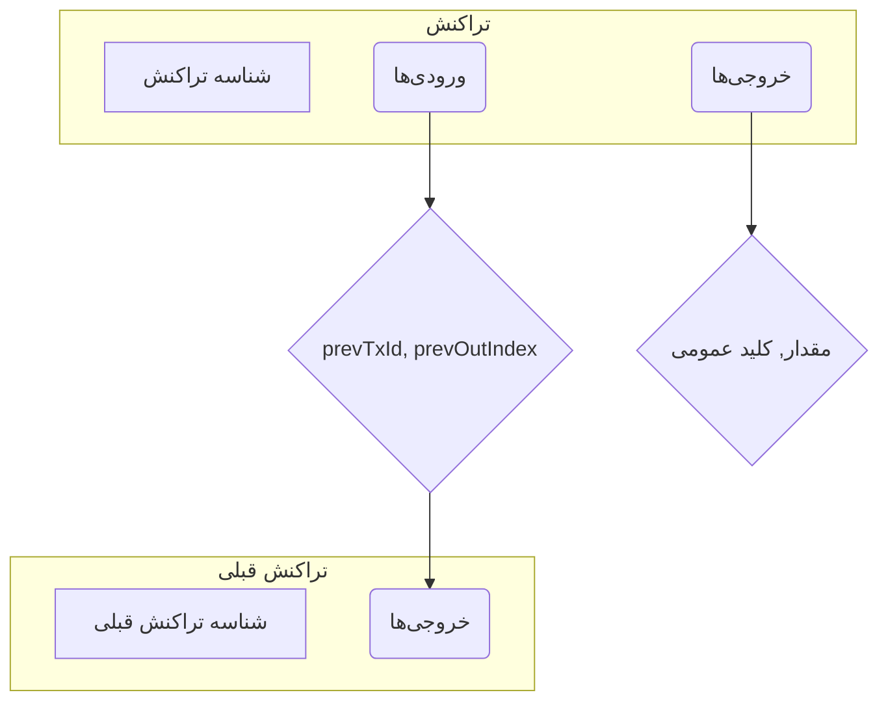
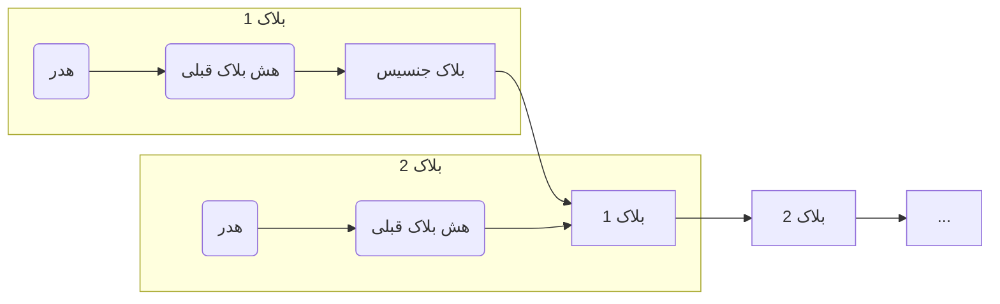

# اصول اولیه بلاکچین

این پروژه از حداقل فیلدهای مورد نیاز برای یک بلاکچین آموزشی و کاربردی استفاده می‌کند.

## بلاک (Block)

بلاک یک ساختار داده است که مجموعه‌ای از تراکنش‌ها را در خود جای می‌دهد. این عنصر سازنده بنیادی بلاکچین است. هر بلاک به بلاک قبلی پیوند خورده و زنجیره‌ای از بلاک‌ها را تشکیل می‌دهد.

یک بلاک از دو بخش اصلی تشکیل شده است: یک هدر و یک بدنه.

### هدر بلاک (Block Header)

هدر بلاک شامل فراداده (metadata) درباره بلاک است.

-   **`prevBlockHash` (32 بایت):** ارجاعی به هش بلاک قبلی در زنجیره. این همان چیزی است که بلاک‌ها را به هم پیوند می‌دهد و بلاکچین را تشکیل می‌دهد. برای بلاک جنسیس (اولین بلاک)، این مقدار یک رشته ۶۴ صفر است.
-   **`merkleRoot` (32 بایت):** ریشه درخت مرکل تمام تراکنش‌های موجود در بلاک. این یک هش رمزنگاری است که امکان تأیید کارآمد یکپارچگی تراکنش‌ها را فراهم می‌کند.
-   **`difficulty` (1 بایت):** مقداری که تعیین می‌کند چقدر یافتن یک هش معتبر برای بلاک دشوار است. این در فرآیند استخراج (ماینینگ) استفاده می‌شود.
-   **`nonce` (4 بایت):** یک مقدار تصادفی که ماینرها آن را تغییر می‌دهند تا یک هش معتبر برای بلاک پیدا کنند که الزامات سختی را برآورده کند.

هش هدر بلاک، `blockHash = Hash(header)`، به عنوان شناسه منحصر به فرد بلاک عمل می‌کند. این هش در خود هدر ذخیره نمی‌شود، بلکه توسط تمام گره‌ها محاسبه می‌شود.

### بدنه بلاک (Block Body)

بدنه بلاک شامل لیستی از تراکنش‌های موجود در بلاک است.

-   **تراکنش‌ها:** لیستی از تراکنش‌ها. اولین تراکنش در این لیست یک تراکنش خاص به نام **تراکنش کوین‌بیس** (coinbase transaction) است. این تراکنش توسط ماینر بلاک ایجاد می‌شود و برای جمع‌آوری پاداش بلاک و هرگونه کارمزد تراکنش استفاده می‌شود.

### اندازه بلاک (Block Size)

"اندازه بلاک" به کل اندازه سریالی‌شده بلاک بر حسب بایت اشاره دارد، شامل هدر و تمام تراکنش‌ها. در این پروژه، ما از یک محدودیت اندازه بلاک ثابت ۲۰۰۰ بایت استفاده می‌کنیم.

## تراکنش (Transaction)

تراکنش یک ساختار داده است که نشان‌دهنده انتقال ارزش بین کاربران بلاکچین است. تراکنش‌ها "بار مفید" (payload) بلاک‌ها هستند.

یک تراکنش از لیستی از ورودی‌ها و لیستی از خروجی‌ها تشکیل شده است.

-   **`inputs[]`:** لیستی از ورودی‌ها. هر ورودی به یک خروجی تراکنش خرج‌نشده قبلی (UTXO) با استفاده از یک زوج `(prevTxId, prevOutIndex)` ارجاع می‌دهد. همچنین شامل یک `publicKey` و یک `signature` برای مجوز دادن به خرج کردن UTXO ارجاع‌داده‌شده است.
-   **`outputs[]`:** لیستی از خروجی‌ها. هر خروجی یک UTXO جدید ایجاد می‌کند، که مقدار مشخصی از سکه‌ها است که به یک `publicKey` خاص قفل شده‌اند. این UTXOها سپس می‌توانند توسط صاحب کلید خصوصی مربوطه در یک تراکنش آتی خرج شوند.
-   **`txid`:** شناسه تراکنش، که هش تراکنش سریالی‌شده است. این به عنوان یک شناسه منحصر به فرد برای تراکنش عمل می‌کند.

### کارمزدها (ضمنی)

کارمزد تراکنش‌ها بخش مهمی از اکوسیستم بلاکچین هستند. آنها انگیزه‌ای برای ماینرها برای گنجاندن یک تراکنش در یک بلاک هستند.

کارمزد تراکنش به صراحت در ساختار داده تراکنش تعریف نشده است. در عوض، به عنوان تفاوت بین مجموع مقادیر ورودی‌ها و مجموع مقادیر خروجی‌ها محاسبه می‌شود.

`کارمزد = مجموع (مقادیر ورودی) - مجموع (مقادیر خروجی)`

کارمزد باید غیرمنفی (`>= 0`) باشد.

ماینری که تراکنش را در یک بلاک قرار می‌دهد، کارمزد تراکنش را جمع‌آوری می‌کند. این کار با افزودن کارمزد به تراکنش کوین‌بیس در بلاک انجام می‌شود.

## زنجیره به عنوان یک لیست پیوندی

بلاکچین اساساً یک دفتر کل توزیع‌شده و تغییرناپذیر است که به عنوان یک لیست پیوندی از بلاک‌ها پیاده‌سازی شده است. هر بلاک به صورت رمزنگاری به بلاک قبلی پیوند خورده است، تا اولین بلاک، که **بلاک جنسیس** نامیده می‌شود.

این پیوند از طریق فیلد `prevBlockHash` در هدر بلاک انجام می‌شود. هر هدر بلاک شامل هش هدر بلاک قبلی است. این یک زنجیره از بلاک‌ها را ایجاد می‌کند که در آن هر بلاک یکپارچگی بلاک قبلی را تأیید می‌کند.

یک گره در شبکه بلاکچین اشاره‌گری به نوک فعلی زنجیره (جدیدترین بلاک اضافه شده) نگه می‌دارد. هنگامی که یک بلاک جدید استخراج می‌شود، گره آن را تأیید می‌کند و اگر معتبر باشد، آن را به زنجیره اضافه می‌کند و اشاره‌گر خود را به نوک جدید به‌روز می‌کند.

## هشینگ رمزنگاری

تابع هش رمزنگاری یک الگوریتم ریاضی است که ورودی با هر اندازه‌ای را می‌گیرد و یک خروجی با اندازه ثابت تولید می‌کند که به عنوان **هش** شناخته می‌شود. این فرآیند یک‌طرفه است، به این معنی که معکوس کردن فرآیند و یافتن ورودی اصلی از هش از نظر محاسباتی غیرممکن است.

در زمینه این پروژه، ما از یک تابع هش (به عنوان مثال، SHA-256) برای چندین هدف استفاده می‌کنیم:

-   **ایجاد `blockHash`:** هش هدر بلاک به عنوان شناسه منحصر به فرد آن عمل می‌کند.
-   **ایجاد `txid`:** هش داده‌های تراکنش به عنوان شناسه منحصر به فرد آن عمل می‌کند.
-   **ساخت درخت مرکل:** درخت مرکل با هش کردن مکرر زوج‌های شناسه‌های تراکنش ساخته می‌شود.

ویژگی‌های کلیدی یک تابع هش رمزنگاری عبارتند از:

-   **قطعی:** یک ورودی یکسان همیشه یک خروجی یکسان تولید می‌کند.
-   **مقاومت در برابر پیش‌تصویر:** یافتن ورودی که هش داده‌شده را تولید کرده است، از نظر محاسباتی غیرممکن است.
-   **مقاومت در برابر پیش‌تصویر دوم:** با داشتن یک ورودی و هش آن، یافتن ورودی متفاوتی که همان هش را تولید کند، از نظر محاسباتی غیرممکن است.
-   **مقاومت در برابر برخورد:** یافتن دو ورودی متفاوت که همان هش را تولید کنند، از نظر محاسباتی غیرممکن است.

## رمزنگاری کلید عمومی

رمزنگاری کلید عمومی، که به عنوان رمزنگاری نامتقارن نیز شناخته می‌شود، یک سیستم رمزنگاری است که از زوجی از کلیدها استفاده می‌کند: یک **کلید عمومی** و یک **کلید خصوصی**.

-   **کلید عمومی:** این کلید می‌تواند با هر کسی به اشتراک گذاشته شود. از آن برای تأیید امضاهای دیجیتال و رمزگذاری پیام‌ها استفاده می‌شود. در بلاکچین ما، کلید عمومی به عنوان "آدرس" که سکه‌ها به آن ارسال می‌شوند، استفاده می‌شود.
-   **کلید خصوصی:** این کلید باید توسط صاحب آن محرمانه نگه داشته شود. از آن برای ایجاد امضاهای دیجیتال و رمزگشایی پیام‌ها استفاده می‌شود.

### امضاهای دیجیتال

امضای دیجیتال یک طرح ریاضی برای تأیید اصالت پیام‌ها یا اسناد دیجیتال است. این امضا سطح بالایی از امنیت را فراهم می‌کند و می‌تواند برای اطمینان از اینکه یک پیام توسط یک فرستنده شناخته شده ایجاد شده است (احراز هویت) و در حین انتقال تغییر نکرده است (یکپارچگی) استفاده شود.

در بلاکچین ما، امضاهای دیجیتال برای مجوز دادن به خرج کردن UTXOها استفاده می‌شوند. هنگامی که یک کاربر می‌خواهد یک UTXO را خرج کند، باید با استفاده از کلید خصوصی خود یک امضای دیجیتال ایجاد کند. این امضا ثابت می‌کند که آنها صاحب کلید عمومی مربوطه هستند و تراکنش را تأیید کرده‌اند.

---
[← بازگشت: پس‌زمینه](background.md) · [بعدی: تراکنش‌ها →](transactions.md)