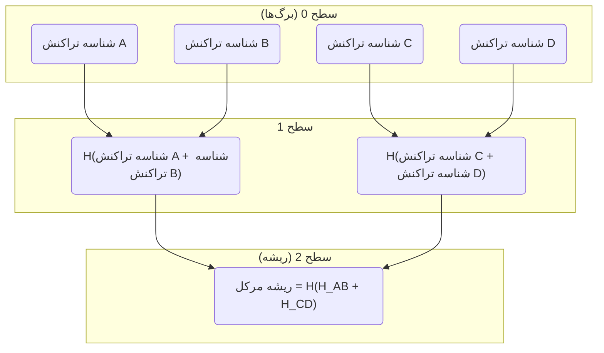
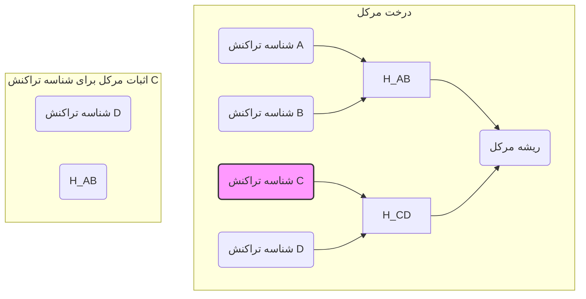

# درختان مرکل و اثبات‌ها

یک درخت مرکل، که به عنوان درخت هش باینری نیز شناخته می‌شود، یک ساختار داده است که در علوم کامپیوتر و رمزنگاری برای تأیید کارآمد یکپارچگی مجموعه‌های بزرگ داده استفاده می‌شود. در زمینه یک بلاکچین، از درخت مرکل برای خلاصه‌سازی تمام تراکنش‌های موجود در یک بلاک استفاده می‌شود که یک هش ۳۲ بایتی به نام **ریشه مرکل** تولید می‌کند.

## چرا اینجا مهم است

ریشه مرکل در هدر بلاک گنجانده شده و چندین مزیت کلیدی را فراهم می‌کند:

-   **تأیید کارآمد:** این امکان را فراهم می‌کند که به روشی سبک و کارآمد بررسی شود که آیا یک تراکنش در یک بلاک گنجانده شده است یا خیر، بدون نیاز به دانلود کل بلاک. این به ویژه برای کلاینت‌های سبک که منابع محدودی دارند مهم است.
-   **مقاومت در برابر دستکاری:** هر تغییری در یک تراکنش، هش آن را تغییر می‌دهد که به نوبه خود هش تمام گره‌های والد در درخت مرکل را تغییر خواهد داد و در نهایت ریشه مرکل را تغییر می‌دهد. این امر تشخیص هرگونه دستکاری در داده‌های تراکنش را آسان می‌کند.

## ساخت یک درخت مرکل

یک درخت مرکل از پایین به بالا ساخته می‌شود، با شروع از برگ‌های درخت که هش تراکنش‌های تکی در بلاک هستند.

در اینجا مراحل ساخت یک درخت مرکل آورده شده است:

1.  **هش کردن تراکنش‌ها:** ابتدا، هش هر تراکنش در بلاک را محاسبه می‌کنیم. این هش‌ها برگ‌های درخت مرکل هستند.
2.  **زوج‌سازی و هش کردن:** سپس، هش‌های برگ‌ها را به صورت زوج گروه‌بندی کرده و هش ادغام هر زوج را محاسبه می‌کنیم. این هش‌های جدید سطح بعدی درخت را تشکیل می‌دهند.
3.  **مدیریت تعداد فرد هش‌ها:** اگر تعداد هش‌ها در هر سطح فرد باشد، آخرین هش برای ایجاد یک زوج تکرار می‌شود.
4.  **تکرار تا رسیدن به ریشه:** فرآیند زوج‌سازی و هش کردن را تا زمانی که تنها یک هش باقی بماند، که ریشه مرکل است، تکرار می‌کنیم.

### مثال

در اینجا مثالی از یک درخت مرکل با چهار تراکنش (A, B, C, و D) آورده شده است:

## اثبات‌های مرکل

اثبات مرکل یک قطعه داده کوچک است که به یک تأییدکننده اجازه می‌دهد تا تأیید کند که یک تراکنش خاص در یک بلاک گنجانده شده است، بدون نیاز به داشتن کل بلاک. اثبات شامل هش تراکنش و لیستی از هش‌های همسایه در مسیر از تراکنش تا ریشه مرکل است.

### نحوه کار

برای تأیید یک اثبات مرکل، یک تأییدکننده به سه قطعه اطلاعات نیاز دارد:

1.  هش تراکنش مورد نظر برای تأیید.
2.  اثبات مرکل، که لیست هش‌های همسایه است.
3.  ریشه مرکل از هدر بلاک.

تأییدکننده سپس از این اطلاعات برای بازسازی ریشه مرکل استفاده می‌کند و بررسی می‌کند که آیا با ریشه مرکل در هدر بلاک مطابقت دارد یا خیر.

### مراحل تأیید

در اینجا مراحل تأیید یک اثبات مرکل برای یک تراکنش آورده شده است:

1.  **با هش تراکنش شروع کنید:** هش تراکنشی را که می‌خواهید تأیید کنید، بردارید.
2.  **ادغام با هش‌های همسایه:** برای هر هش در اثبات مرکل، آن را با هش فعلی ادغام کرده و هش نتیجه را محاسبه کنید. ترتیب ادغام بستگی به این دارد که آیا همسایه یک گره چپ یا راست در درخت است.
3.  **تکرار تا رسیدن به ریشه:** این فرآیند را تا زمانی که به یک هش واحد برسید، ادامه دهید.
4.  **مقایسه با ریشه مرکل:** هش حاصل را با ریشه مرکل از هدر بلاک مقایسه کنید. اگر مطابقت داشته باشند، ثابت می‌شود که تراکنش در بلاک گنجانده شده است.

### مثال

فرض کنید می‌خواهیم ثابت کنیم که تراکنش C در بلاک از مثال قبلی ما قرار دارد. اثبات مرکل شامل هش تراکنش D و هش `H_AB` خواهد بود.

برای تأیید اثبات، تأییدکننده مراحل زیر را انجام می‌دهد:

1.  هش تراکنش C را برای به دست آوردن `شناسه تراکنش C` محاسبه می‌کند.
2.  `شناسه تراکنش C` را با اولین عنصر اثبات (`شناسه تراکنش D`) ادغام کرده و هش نتیجه را برای به دست آوردن `H_CD` محاسبه می‌کند.
3.  دومین عنصر اثبات (`H_AB`) را با `H_CD` ادغام کرده و هش نتیجه را برای به دست آوردن `H_ABCD` محاسبه می‌کند.
4.  `H_ABCD` را با ریشه مرکل از هدر بلاک مقایسه می‌کند. اگر مطابقت داشته باشند، اثبات معتبر است.

---
[← بازگشت: استخراج](mining.md) · [بعدی: امضاهای دیجیتال و پیش‌تصویر تراکنش →](signatures-preimage.md)